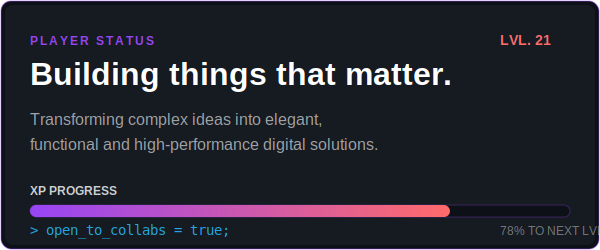
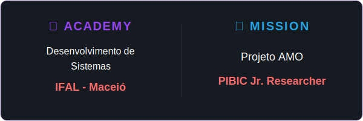
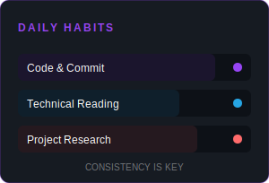
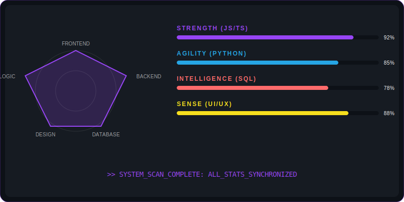

<!-- HEADER: Premium Minimalist Banner -->

 

<!-- DASHBOARD GRID 1: Bio & Mission (Aligned 200px height) -->
<table width="100%" border="0" cellspacing="0" cellpadding="0" style="border-collapse: collapse;">
  <tr>
    <td width="55%" valign="top">
      
    </td>
    <td width="3%"></td>
    <td width="42%" valign="top">
      
    </td>
  </tr>
</table>

 

<!-- DASHBOARD GRID 2: Academy/Research & Daily Habits (Aligned 200px height) -->
<table width="100%" border="0" cellspacing="0" cellpadding="0" style="border-collapse: collapse;">
  <tr>
    <td width="62%" valign="top">
      
    </td>
    <td width="3%"></td>
    <td width="35%" valign="top">
      
    </td>
  </tr>
</table>

 

---

### ⚔️ Combat Arsenal (Tech Stack)

  

 

  
  
  

---

### 📊 System Analysis (Character Stats)

  

---

### 🏆 Achievement Trophies

  

---

### 📈 Activity Matrix

  

---

### 🤝 Connectivity Hub

 

*“The system has chosen you to level up.”*

 

<!-- Snake Animation: Footer -->

 

