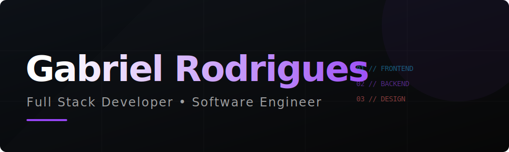

<!-- HEADER: Shadow Sovereign Banner -->

 

<!-- PLAYER STATUS: Dashboard Local -->
<table width="100%" border="0" cellspacing="0" cellpadding="0" style="border-collapse: collapse;">
  <tr>
    <td width="62%" valign="top" style="padding: 0; margin: 0;">
      
    </td>
    <td width="3%" style="padding: 0; margin: 0;"></td>
    <td width="35%" valign="top" style="padding: 0; margin: 0;">
      

        <h4 style="color: #9745F5; margin-bottom: 8px; font-family: sans-serif; letter-spacing: 2px; font-weight: 900;">🎓 ACADEMY</h4>
        
Desenvolvimento de Sistemas <b style="color: #FF6B6B;">IFAL - Maceió</b>

        

        <h4 style="color: #26A5E4; margin-bottom: 8px; font-family: sans-serif; letter-spacing: 2px; font-weight: 900;">🧪 MISSION</h4>
        
Projeto AMO <b style="color: #FF6B6B;">PIBIC Jr. Researcher</b>

      

    </td>
  </tr>
</table>

 

---

### ⚔️ Combat Arsenal (Tech Stack)

  

---

### 📊 System Analysis (Character Stats)
<!-- Usando SVG Local para estabilidade 100% e visual Premium -->

  

---

### 📈 Activity Pulse

  

---

### 🤝 Connectivity Hub

 

*“The system has chosen you to level up.”*

 

<!-- Snake Animation: Footer -->

 

